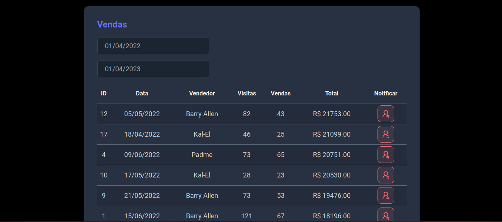

<h1 align="center"> Sales Notification</h1>

<p align="center">
  <a href="#-tecnologias">Tecnologias</a>&nbsp;&nbsp;&nbsp;|&nbsp;&nbsp;&nbsp;
  <a href="#-projeto">Projeto</a>&nbsp;&nbsp;&nbsp;|&nbsp;&nbsp;&nbsp;
  <a href="#-deploy">Deploy</a>&nbsp;&nbsp;&nbsp;|&nbsp;&nbsp;&nbsp;
  <a href="#memo-licença">Licença</a>
</p>

<p align="center">
  
</p>

<br>

<p align="center">
  
</p>

## 🚀 Tecnologias

Esse projeto foi desenvolvido com as seguintes tecnologias:

- React.JS
- Spring Boot
- SQL
- Axios
- Twillo

## Instalação do projeto


- Clone o repositório do GitHub:

```bash
git clone https:https://git@github.com:Rodrigo-Monteiro-Lima/Sales-Notification.git
```
Entre na pasta do projeto com o comando 

```javascript
cd Sales-Notification
```

Iniciando o front:

```javascript
cd frontend
```

Instale as dependências com o comando

```javascript
npm install
```
Inicie o servidor local com o comando

```javascript
npm start
```

Iniciando o backend: 

```javascript
cd backend
```

Inicie o servidor pelo o editor de código que voce escolher.

Abra o navegador e acesse o endereço http://localhost:3000


## 💻 Projeto

É um projeto para gerenciar e filtrar as vendas feitas pelos funcionários, tendo a possibilidade de enviar notificações via SMS com o nome, data e o valor vendido para um telefone.

## 🔖 Deploy

Acesse esse site por: [Netlfiy](https://https:/sale-notification.netlify.app/)


## :memo: Licença

Esse projeto está sob a licença MIT.

---
